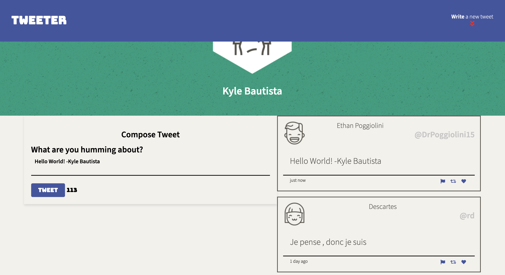

# Twitter Project

This project is a simple implementation of a Twitter-like platform where users can post tweets. It includes a simple user interface with interactive icons that change on hover.

## Features

- **Post Tweets**: Users can post their own tweets.
- **View Tweets**: The latest tweets are displayed after the form to post new tweets.
- **User-Friendly Interface**: Simple and clean layout for users to easily interact with the app.

## Technologies Used

- **Node.js**: JavaScript runtime for building the backend.
- **Express.js**: Web framework for handling routes and HTTP requests.
- **EJS**: Templating engine for rendering HTML.
- **CSS**: Used for styling the user interface, including hover effects on interactive icons.

## Dependencies

This project uses the following dependencies:

- **body-parser**: A middleware to parse incoming request bodies (Version: `^1.15.2`).
- **chance**: A library for generating random data, used for some sample data in the app (Version: `^1.0.2`).
- **express**: The web framework used to handle routing and requests (Version: `^4.13.4`).
- **md5**: A library for creating MD5 hash, used for hashing (Version: `^2.1.0`).

## Final product/Screenshot

